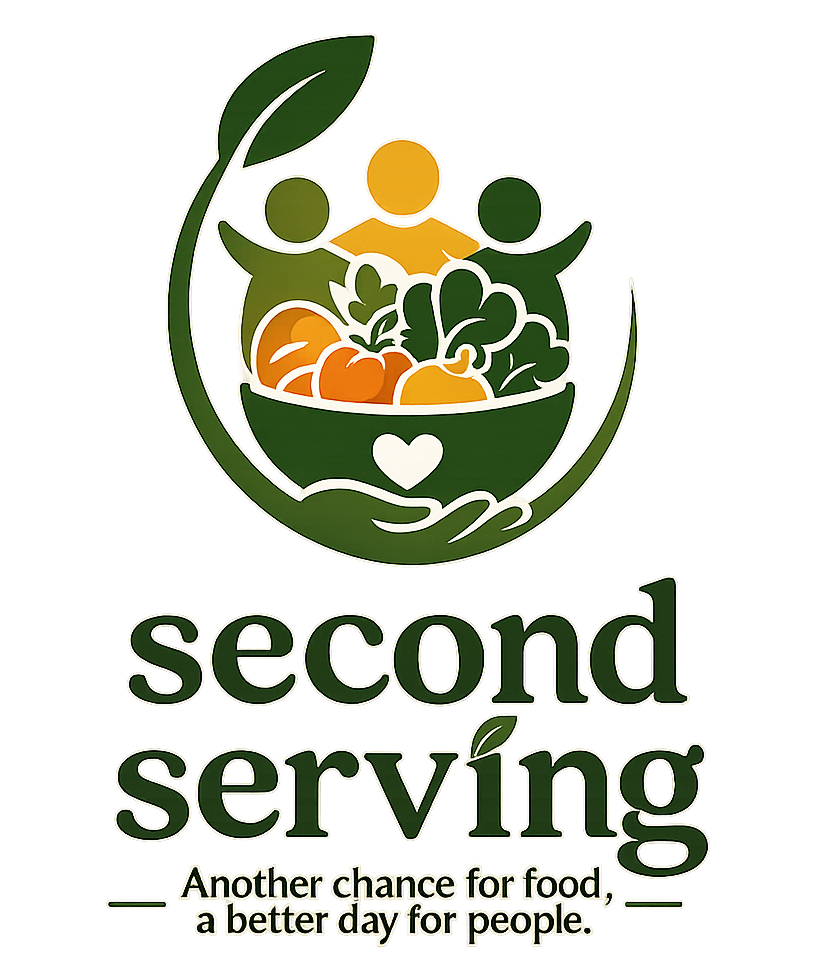

<p align="center">
  
  <br>
  <h1 align="center">Second Serving</h1>
</p>

<p align="center">
  Connecting food contributors with those in need — turning surplus into sustenance.
</p>

# Overview

Second Serving is a full-stack web platform that bridges the gap between food donors (restaurants, catering businesses, etc.) and receivers (individuals or organizations in need). Contributors can post surplus food donations with pickup details, and receivers can browse, filter, and claim available listings before they expire. An AI-assisted posting flow lets contributors describe food in plain language and automatically extracts structured donation details.

## Key Components

### 1. Contributor Dashboard
Restaurants and food contributors can create and manage their food donation posts. The dashboard displays active, claimed, and expired listings with full lifecycle tracking. An AI-powered description parser (via OpenAI) extracts food name, quantity, dietary tags, and allergens from a natural-language description.

### 2. Receiver Homepage
Registered receivers browse all available food listings with live filtering by dietary type, allergens, storage type, and location. Each listing card shows pickup time, quantity, and expiration status. Receivers can claim a listing and view their claimed foods history.

### 3. Authentication & Role-Based Access
JWT-based auth supports two distinct user roles — `contributor` and `receiver` — each with separate registration flows and protected routes. Password reset via email is supported.

### 4. Living Tree Visualization
The landing page features a tree whose canopy fills with leaves and flowers as donations accumulate, providing an engaging visual representation of community impact.

<p align="center">
  
  
  We start with this wilted tree. The wilted tree represents the substantial amount of food waste and hunger our community faces while others go hungry. But as more people donate food on our website, more leaves and flowers bloom to represent them. We hope to make the tree as bountiful as it can get. 

  

  <h4 align="center">Second Serving</h4>

</p>

## Folder Structure

```text
second_serving/
├── backend/
│   ├── app/
│   │   ├── api/routes/     # FastAPI route handlers (auth, donations, claims, ai, profile, card)
│   │   ├── core/           # Database engine, config, settings
│   │   ├── crud/           # Database access layer
│   │   ├── models/         # SQLAlchemy ORM models (User, Donation, Claim)
│   │   ├── schemas/        # Pydantic request/response schemas
│   │   └── main.py         # App entrypoint, middleware, router registration
│   ├── alembic/            # Database migrations
│   ├── uploads/            # Uploaded files (proof of address)
│   ├── requirements.txt
│   └── .env.example
├── frontend/
│   ├── public/             # Static assets (logo, tree image)
│   ├── src/
│   │   ├── components/     # Shared UI components (Header, Footer, FoodCard, etc.)
│   │   ├── contexts/       # React context providers (AuthContext)
│   │   ├── pages/          # Page-level components (Landing, Homepage, Dashboard, etc.)
│   │   └── utils/          # Utility helpers
│   ├── package.json
│   └── vite.config.ts
└── README.md
```

## Installation Instructions

### 1. Clone the Repository

```sh
git clone <repository-url>
cd second_serving
```

### 2. Set Up the Backend

```sh
cd backend
python3 -m venv venv
source venv/bin/activate
pip install -r requirements.txt
```

Copy the environment file and fill in your values:

```sh
cp .env.example .env
```

Required `.env` values:
- `DATABASE_URL` — SQLite or PostgreSQL connection string
- `SECRET_KEY` — JWT signing secret
- `OPENAI_API_KEY` — OpenAI API key for the AI description parser

### 3. Set Up the Frontend

```sh
cd ../frontend
npm install
```

## Running Instructions

### 1. Start the Backend

```sh
cd backend
source venv/bin/activate
uvicorn app.main:app --reload
```

The API will be available at `http://localhost:8000`.

### 2. Start the Frontend

```sh
cd frontend
npm run dev
```

The app will be available at `http://localhost:5173`.

## Technologies Used

**Backend**
- Python / FastAPI
- SQLAlchemy (async) + Alembic migrations
- SQLite (dev) / PostgreSQL (prod)
- JWT authentication (`python-jose`)
- OpenAI API (food description parsing)

**Frontend**
- React 19 + React Router v7
- Vite + Tailwind CSS
- Role-based protected routes

## Features

- Role-based user accounts: contributor (donor) and receiver
- Restaurant and receiver registration with proof-of-address upload
- AI-powered food posting — describe surplus in plain English and let the system extract structured data
- Real-time dietary and allergen filtering on the food listings page
- Claim management with history tracking for receivers
- Expired listing detection and archival
- Animated living-tree visualization on the landing page reflecting total donation volume
- JWT authentication with password reset flow

## Future Improvements

- Email notifications for new listings matching a receiver's saved filters
- Map-based pickup location view
- Rating and feedback system between contributors and receivers
- Mobile-responsive PWA

## Contributors

- Hokulani 26 Team

## License

MIT License
